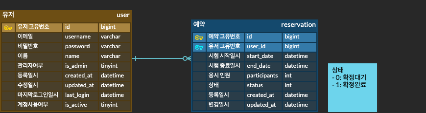
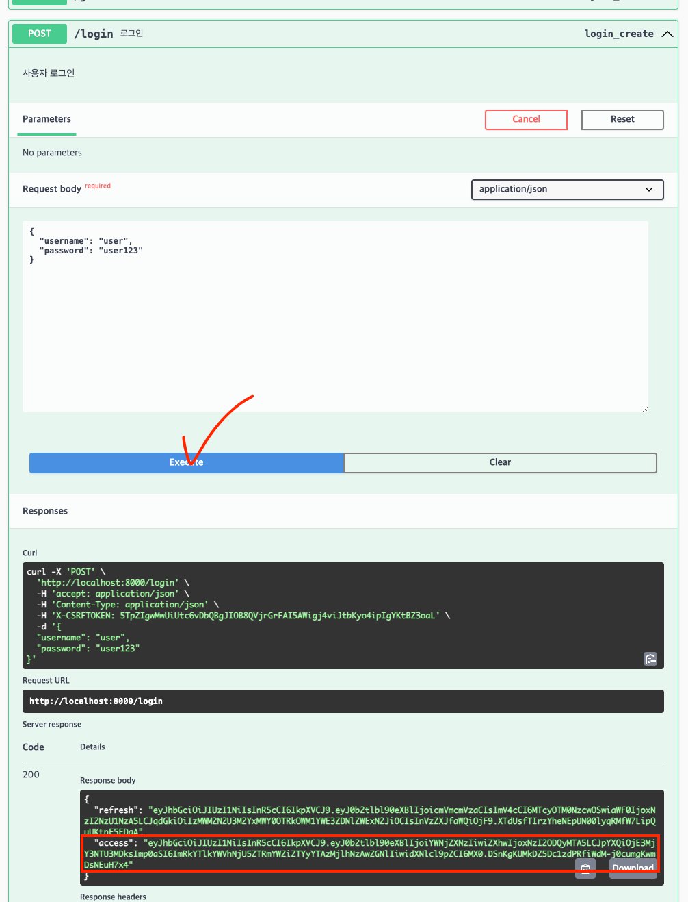
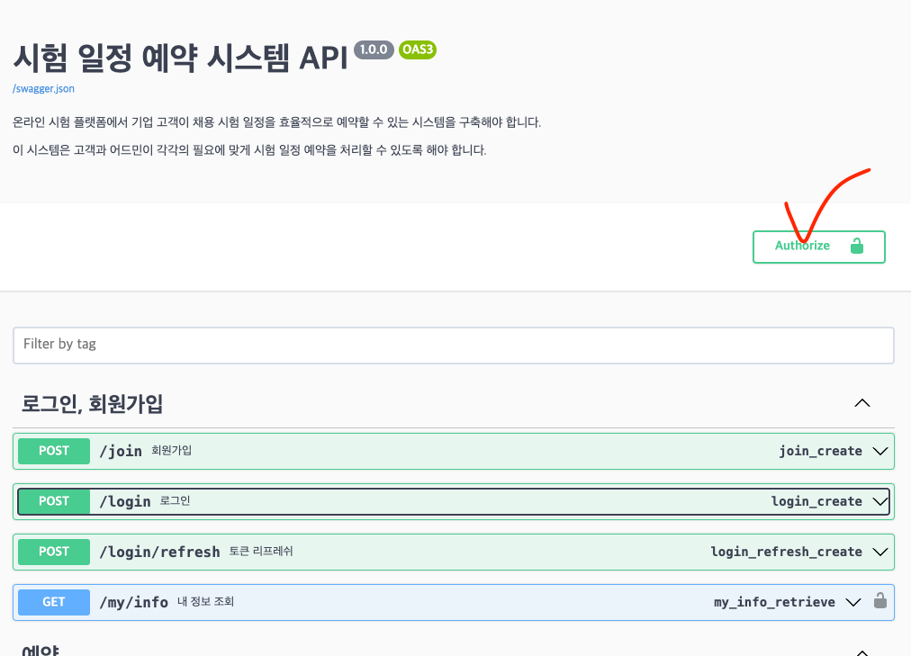
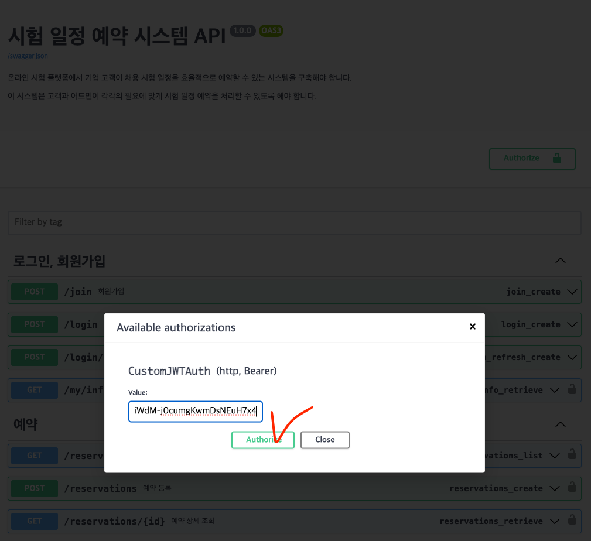

# exam-reservation-system
시험 일정 예약 시스템

## 기능

- **예약 조회 및 신청**: 고객은 예약 가능한 시간과 인원을 확인하고 예약 신청을 할 수 있습니다. 예약은 시험 시작 3일 전까지 신청 가능하며, 동 시간대에 최대 5만 명까지 예약할 수 있습니다.
- **예약 수정 및 확정**: 고객은 확정 전 본인 예약을 수정할 수 있고, 어드민은 모든 고객의 예약을 수정 및 확정할 수 있습니다.
- **예약 삭제**: 고객은 확정 전 본인 예약을 삭제할 수 있으며, 어드민은 모든 고객의 예약을 삭제할 수 있습니다.
- **권한 관리**: 일반 고객은 예약을 생성할 수 있고, 어드민은 예약을 확정 및 관리할 수 있습니다.

## API

프로젝트가 설정된 후에는 다음 엔드포인트를 통해 기능을 테스트할 수 있습니다.

자세한 내용은 API 문서 (Swagger 또는 Redoc) 참고 부탁드립니다.

#### 로그인, 회원가입

- **회원가입**: `POST /join`
- **로그인**: `POST /login`
- **토큰 리프레시**: `POST /login/refresh`
- **내 정보 보기**: `GET /my/info`

#### 유저

- **유저 리스트 조회**: `POST /users`

#### 예약

- **예약 리스트 조회**: `GET /reservations`
- **예약 상세 조회**: `GET /reservations/{id}`
- **예약 등록**: `POST /reservations`
- **예약 수정**: `PUT /reservations`
- **예약 삭제**: `DELETE /reservations`
- **예약 확정**: `POST /reservations/{id}/confirm`


### 사용 기술 스택

- **백엔드**: Python 3.11, Django 5.1.1, Django REST Framework 3.15.2
- **데이터베이스**: PostgreSQL 15.8
- **API 문서 자동화**: drf-spectacular (Swagger, Redoc)
- **컨테이너화**: Docker, Docker Compose


### ERD



---

## 시작하기

로컬 환경에서 프로젝트를 설정하고 실행하기 위한 단계는 다음과 같습니다.

### 사전 준비

- Docker 및 Docker Compose가 설치되어 있어야 합니다.
- Docker Desktop 앱이 설치 및 **실행**되고 있어야 합니다.
  - [https://www.docker.com/products/docker-desktop/](https://www.docker.com/products/docker-desktop/)

### 설치 및 설정

1. **git clone 후 프로젝트 디렉토리로 이동**:

    ```bash
    git clone https://github.com/leeyongjo-o/exam-reservation-system.git
    cd exam-reservation-system
    ```

2. **Docker Compose 실행**:

    - 관리자 권한으로 명령어를 실행하여 Docker 컨테이너를 빌드하고 실행합니다.
      - -d: 백그라운드 실행

    ```bash
    sudo docker-compose up --build
    ```

    - 다음과 같은 서비스가 설정됩니다:
        - **Web**: Django 애플리케이션 (Port: 8000)
        - **Database**: PostgreSQL 데이터베이스 및 초기 데이터 (Port: 5432)
    - 만약 [error getting credentials 오류 발생 시 해결법](https://dslyh01.tistory.com/64) 참고 부탁드립니다.

3. **애플리케이션 접속**:

    - API 문서는 [http://localhost:8000/swagger](http://localhost:8000/swagger) 에서 확인할 수 있습니다.

4. **기능 테스트 진행**:

   1. 회원 가입 후 로그인 진행 또는 다음의 계정으로 로그인 진행
       ```
       # 고객
       아이디: user
       비밀번호: user123
      
       # 어드민
       이메일: admin
       비밀번호: admin123
       ```
      - 고객
        - 아이디: user / user2 / user3 / …
        - 비밀번호: user123
      - 어드민
        - 아이디: admin / admin2 /admin3
        - 비밀번호: admin123 
      
      > *날짜 형식은 다음과 같이 요청 부탁드립니다. ```2024-09-19 20:00:00```

   2. 로그인 후 얻은 access 값으로 Authorize 진행
      - 인가를 위해 Authorization 헤더에 인증 토큰 설정 필요
      - access 토큰을 그대로 입력 (Bearer는 자동으로 설정되도록 구성)
      
      
      
      
  
5. **Docker Compose 종료**:
   - 테스트 완료 후 Docker 컨테이너를 종료합니다.
   - `Ctrl + C` 입력 또는 명령어를 실행 (백그라운드 실행 시) 
     - -v: 볼륨 삭제
     ```
     sudo docker-compose down
     ```

#### 참고 사항

- 권한이 필요한 API 요청에는 Authorization 헤더에 인증 토큰을 포함해야 합니다.
- 예약 조회, 수정, 삭제 API에서 유저는 자신의 데이터만 접근할 수 있습니다.
- 페이지네이션을 지원하는 엔드포인트에서는 page_no, page_size 쿼리 파라미터를 사용하여 페이지를 탐색할 수 있습니다.


### API 문서

- **Swagger UI**: [http://localhost:8000/swagger](http://localhost:8000/swagger)
- **Redoc**: [http://localhost:8000/redoc](http://localhost:8000/redoc)
